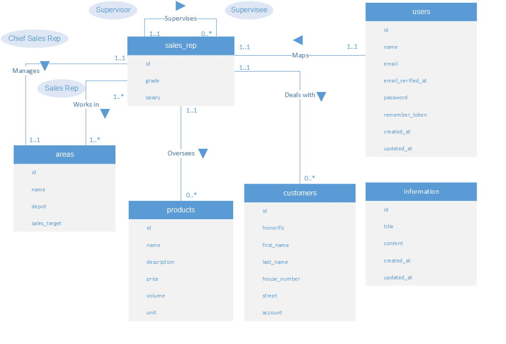

# BackEnd

## General Explanation

BackEnd is designed to receive requests from FrontEnd and return JSON response.

## Databaes Entity Relation



## Developed with

-   [Laravel](https://laravel.com/docs/11.x)
-   [Composer](https://getcomposer.org/)
-   [XAMPP](https://www.apachefriends.org/jp/index.html)

## Setup

```
composer install
```

## Run with built-in server

```
php artisan serve
```
