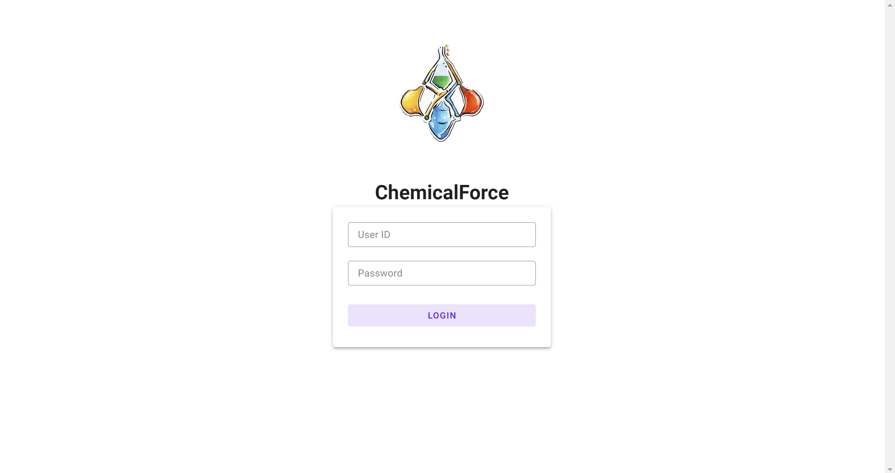
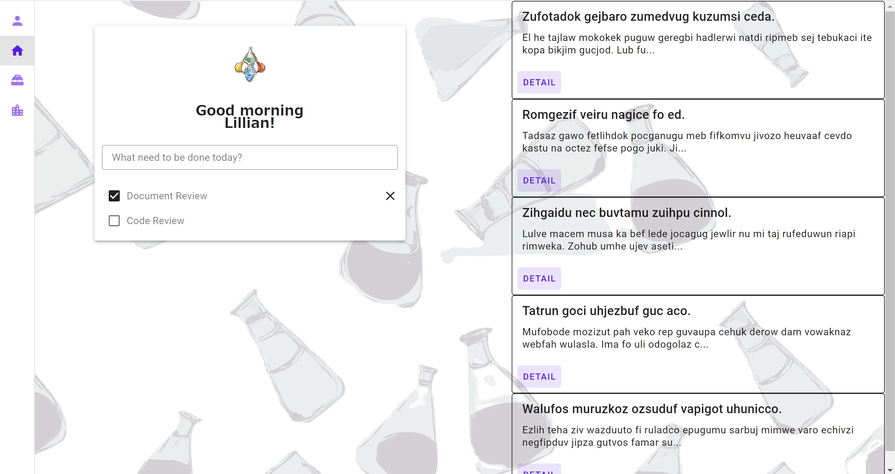
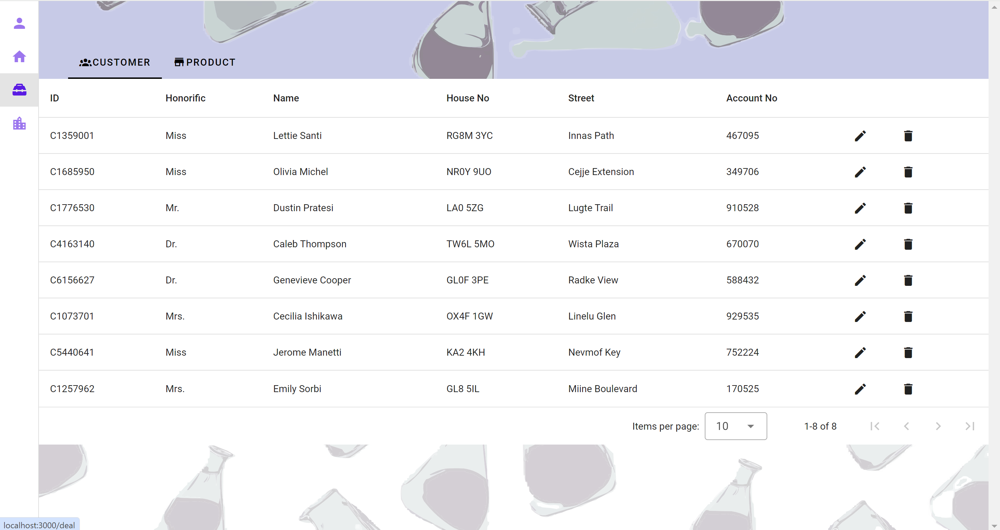
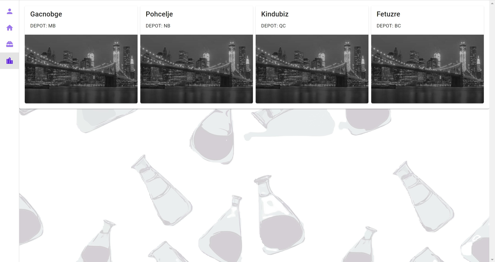

# FrontEnd



---



---



---



## Developed with

- [Vue3](https://github.com/vuejs)
- [Vuetify](https://github.com/vuetifyjs/vuetify)
- [Pinia](https://github.com/vuejs/pinia)
- [TypeScript](https://github.com/microsoft/TypeScript)
- [Mock Service Worker](https://mswjs.io/)
- [Axios](https://axios-http.com/)

## Project setup

```
npm install
```

## Project build

```
npm run build
```

## Project build and hot-reloads for dev

```
npm run dev
```
